# QureX — Master Implementation Plan

**Tagline:** "Where Quantum meets the Road."

## Executive Summary
QureX is a hybrid quantum-classical urban traffic optimization platform designed to solve multi-intersection congestion and prioritize emergency vehicles in real time. The platform follows a frozen 6-layer pipeline architecture. Four engineers (M1–M4) work in parallel on dedicated git branches (`m1-stats`, `m2-graph`, `m3-quantum`, `m4-ui`) without altering frozen signatures or cross-layer contracts (`config.py`, `contracts.py`).

---

## 1. Per-Member Work Packages & Numeric Definitions of Done

### Member 1 (M1) — Statistical Sanitization & Predictive Wave Forecast
- **Files Owned:** `stats_layer.py`, `forecast_layer.py`
- **Layer 2 Logic (`stats_layer.py`):**
  - Synthesize historical baseline data ($N = 2000$ rows $\times 18$ features) using correlated latent factor demand generator ($D \sim \mathcal{N}(0,1)$, $e_i \sim \mathcal{N}(0,1)$).
  - Compute covariance matrix with Ledoit-Wolf shrinkage ($\Sigma = \text{LedoitWolf}(X).\text{covariance\_}$).
  - Compute Mahalanobis distance $D(x) = \sqrt{(x-\mu)^T \Sigma^{-1} (x-\mu)}$; anomaly threshold $\text{threshold} = \sqrt{\chi^2_{18, 1-\alpha}}$ ($\alpha = 0.001 \Rightarrow \text{threshold} \approx 6.50$).
  - Perform `StandardScaler` + `PCA(n_components=0.95)` on standardized features; return 1-D `eigen_features` array ($k$ components).
  - Cache lazy singleton model fit (fit once, never refit on Streamlit reruns).
- **Layer 3 Logic (`forecast_layer.py`):**
  - Train `xgboost.XGBRegressor` with multi-output 2-D target ($y \in \mathbb{R}^{N \times 6}$), `tree_method="hist"`, `n_estimators=200`, `max_depth=3`, `learning_rate=0.08`, `subsample=0.9`, `random_state=RANDOM_SEED`.
  - Queue balance dynamics for target generation: $q_{t+T} = \text{clip}(q_t + (\lambda_i - \mu_i)\cdot T, 0, C_i) + \varepsilon$ ($T=300\text{ s}$).
  - Clip output forecast to $[0, C_i]$ in `NODE_IDS` order.
- **Inputs / Outputs:** `grid_state` $\to$ `StatsResult` $\to$ `forecast: np.ndarray (6,)`
- **Numeric Acceptance Criteria (Definition of Done):**
  - Default state is NOT anomalous ($D < 6.50$).
  - `CONGESTION`, `ACCIDENT`, and `FESTIVAL` events flag `is_anomaly = True`.
  - `EMERGENCY` event flags `is_anomaly = False` ($D < 6.50$).
  - PCA variance retained $\ge 0.95$; `eigen_features` is strictly 1-D.
  - XGBoost forecast shape is strictly `(6,)`, finite, clipped to $[0, C_i]$.
  - Forecast beats persistence baseline ("queue stays same") in MAE and RMSE on a hold-out test set.
  - Layer 2 + Layer 3 execution time $< 50\text{ ms}$ (warm).

---

### Member 2 (M2) — Ingestion, Network Topology & Emergency Routing
- **Files Owned:** `scenario.py`, `graph_layer.py`, `routing_layer.py`
- **Layer 1 Logic (`scenario.py`):**
  - Finalize 5 scenario presets: `NORMAL` (12, 50, 25%, 42 km/h), `CONGESTION` (45, 50, 90%, 6 km/h), `ACCIDENT` (38, 15, 95%, 2 km/h), `EMERGENCY` (24, 50, 60%, 22 km/h), `FESTIVAL` (40, 50, 82%, 12 km/h).
  - `apply_event` returns a NEW `GridState` without mutating input state; `FESTIVAL` applies to all nodes.
- **Layer 4 Logic (`graph_layer.py`):**
  - `build_city_graph`: $2 \times 3$ grid NetworkX graph, explicit `NODE_IDS` order, `travel_cost = 20.0 s`.
  - `triage`: Mark critical nodes where utilization $u_i = \hat{q}_i / C_i > 0.60$ OR $event_i \neq \text{NORMAL}$.
  - Cap `critical_nodes` to `MAX_QUBITS = 6` (sorting by urgency $w_i = q_i / C_i$).
  - Compute normalized urgency weights $w_i$ ($\max w_i = 1.0$).
  - Compute coupling weights $J_{ij} = \kappa \cdot \frac{w_i + w_j}{2} \cdot \frac{\tau_{\text{ref}}}{\tau_{ij}}$ ($\kappa = 0.5$) for adjacent critical nodes; key tuple $(a, b)$ ordered by `NODE_IDS.index(a) < NODE_IDS.index(b)`.
- **Layer 6a Logic (`routing_layer.py`):**
  - Dijkstra corridor calculation (`nx.shortest_path`) targeting `EMERGENCY_TARGET = "Intersection_1"`.
  - Loop over all sources where $event_i == \text{EMERGENCY}$.
  - Handle edge cases: source == target $\Rightarrow$ `[target]`; no path $\Rightarrow$ `[]`; multiple emergencies $\Rightarrow$ ordered union of path nodes.
  - Override phases along corridor with `PHASE_EMERGENCY_CORRIDOR`.
- **Inputs / Outputs:** `grid_state`, `forecast`, `G` $\to$ `TriageResult`, `(Phases, corridor: List[str])`
- **Numeric Acceptance Criteria (Definition of Done):**
  - All 5 scenario events run end-to-end without exceptions.
  - `validate_triage` passes for all scenarios.
  - `critical_nodes` length never exceeds 6.
  - Coupling keys strictly obey `NODE_IDS.index(a) < NODE_IDS.index(b)`.
  - Emergency routing handles Intersection_1 (source=target), distant nodes, and 2 simultaneous emergencies safely.
  - `apply_event` never mutates input dictionary.

---

### Member 3 (M3) — Quantum Core & Queue Metrics Model
- **Files Owned:** `quantum_layer.py`, `classical_solver.py`, `metrics.py`
- **Layer 5 Logic (`quantum_layer.py` & `classical_solver.py`):**
  - Decision variables $x_i \in \{0,1\}$ ($1 = \text{MAX\_GREEN}$, $0 = \text{ADAPTIVE\_SHORT}$).
  - Cost function: $C(x) = - \sum_i w_i x_i + \sum_{(i,j)} J_{ij} x_i x_j + \lambda (\sum_i x_i - K)^2$, where $K = \max(1, \lceil 0.5 n \rceil)$, $\lambda = 0.5 \bar{w}$.
  - Expand QUBO to linear $a_i = -w_i + \lambda(1-2K)$ and quadratic $Q_{ij} = 2\lambda + J_{ij}$.
  - Map to Ising Hamiltonian $H_C = \sum_i h_i Z_i + \sum_{i<j} J'_{ij} Z_i Z_j + \text{const}$ via $x_i = (1 - Z_i)/2$.
  - Assert numerical equivalence: $\text{QUBO}(x) \equiv H_C(Z)$ on all $2^n$ bitstrings in tests.
  - Implement $p=2$ QAOA circuit in PennyLane (`RZ(2\gamma_l h_i)`, `IsingZZ(2\gamma_l J'_{ij})`, `RX(2\beta_l)`) using scalar angles.
  - CVaR objective ($\alpha = 0.2$, $S=1024$ samples) optimized via SciPy COBYLA ($\max \text{iter}=80$, 3 seeded restarts).
  - Extract elite bitstring ($1 \to \text{PHASE\_MAX\_GREEN}$, $0 \to \text{PHASE\_ADAPTIVE\_SHORT}$).
  - `classical_solver.py`: Exact brute-force solver over all $2^n$ states ($n \le 6$) as correctness oracle.
- **Metrics Logic (`metrics.py`):**
  - Discrete-time simulation ($dt=1\text{ s}$, horizon $T=300\text{ s}$) with main and cross approaches.
  - Inflow rates $\lambda_m = 0.8 \mu_{\text{fixed}} + (\hat{q} - q)/T$, $\lambda_c = 0.75 \lambda_m$.
  - Account for wasted green and downstream free-storage capacity limitations ($C_j - q_j$).
  - Evaluate Fixed-time ($g=0.5$), Actuated ($g = \text{clip}(\frac{\lambda_m}{\lambda_m + \lambda_c}, 0.35, 0.65)$), and QureX ($g=0.65$ on MAX_GREEN, actuated on ADAPTIVE_SHORT, $g=1.0$ on EMERGENCY_CORRIDOR).
  - Derive fuel saved ($\text{veh}\cdot\text{s} \to \text{gallons}$ using $0.3\text{ gal/h}$ idling assumption) and $\text{CO}_2$ saved ($8.887\text{ kg CO}_2 / \text{gal}$).
- **Inputs / Outputs:** `TriageResult` $\to$ `Phases`; `(grid_state, phases, triage, corridor)` $\to$ `KPIResult`
- **Numeric Acceptance Criteria (Definition of Done):**
  - $\text{QUBO}(x) \equiv H_C(Z)$ assertion passes strictly across all states.
  - QAOA elite bitstring matches exact brute-force optimum in $\ge 95\%$ of $\ge 100$ random test instances ($n \le 6$).
  - Quantum optimization solve time $< 5.0\text{ s}$ per call.
  - KPIs respond dynamically when signal phases change (no hard-coded multipliers).
  - Sensitivity analysis table verified across varying service rates and coupling strengths.

---

### Member 4 (M4) — UI Dashboard, Co-pilot & Integration
- **Files Owned:** `app.py`, `copilot_layer.py`, `pipeline.py`, `ui_components.py`, `requirements*.txt`, `README.md`, `docs/`
- **Layer 6b Logic (`copilot_layer.py`):**
  - OpenAI-compatible client connecting to Featherless AI (`https://api.featherless.ai/v1`).
  - Safe secrets access (`try: st.secrets[...] except: None`).
  - Feed structured facts; instruct $\le 2$ sentences, formal narration.
  - Deterministic template fallback tagged `[LOCAL AI CO-PILOT - DETERMINISTIC MODE]` if API key missing or request fails.
- **UI Logic (`app.py` & `ui_components.py`):**
  - Rebrand all text/titles to **QureX** ("Where Quantum meets the Road.").
  - Live incident console sidebar (Intersection selection, event deployment, reset).
  - Required panels: Network topology graph, per-node queue & forecast table, emergency route ETA list, fuel & $\text{CO}_2$ metrics, fixed vs. actuated vs. QureX comparison bar chart, statistical diagnostics (Mahalanobis $D$ vs threshold, PCA scree), co-pilot summary box, and prominent **"Simulated data"** badge.
  - Use `st.cache_resource`, `width="stretch"`, `plt.close(fig)` after Matplotlib renders.
- **Pipeline Integration (`pipeline.py`):**
  - Orchestrate 6-layer call order cleanly.
- **Numeric Acceptance Criteria (Definition of Done):**
  - Clean run on fresh clone without any `.streamlit/secrets.toml` file (graceful fallback).
  - Warm pipeline execution time $< 2.0\text{ s}$.
  - `streamlit.testing.v1.AppTest` passes with 0 exceptions.
  - All 8 required UI dashboard panels present and responsive.

---

## 2. Timeline & Mid-Way Integration Checkpoint

```mermaid
gantt
    title QureX Development & Integration Timeline
    dateFormat  HH:mm
    axisFormat %H:%m

    section Phase 1: Setup
    Step 1 Baseline & Python 3.12 Setup   :done, p1, 00:00, 00:30
    Step 2 Implementation Plan & PRs     :active, p2, 00:30, 01:00

    section Phase 2: Parallel Build
    M1 Stats & Forecast Implementation    :m1, 01:00, 03:00
    M2 Network & Routing Implementation   :m2, 01:00, 03:00
    M3 Quantum Core & Metrics Model       :m3, 01:00, 03:00
    M4 UI Dashboard & Co-pilot           :m4, 01:00, 03:00

    section Phase 3: Integration
    Checkpoint 1 (Merge M1 stats & forecast) :cp1, 03:00, 03:20
    Checkpoint 2 (Merge M2 graph & routing)  :cp2, 03:20, 03:40
    Checkpoint 3 (Merge M3 quantum & KPIs)   :cp3, 03:40, 04:00
    Full App Testing & 5 Events Rehearsal    :cp4, 04:00, 04:30
```



### Integration Checkpoint Protocol:
1. **Order of Stub Replacement:** `M1 (Stats/Forecast)` $\to$ `M2 (Graph/Routing)` $\to$ `M3 (Quantum/Metrics)`.
2. After each member merges to `main`, **M4 runs full pipeline regression** via `pytest -q` and `AppTest`.
3. If any contract mismatch is uncovered, the **producer** of the data updates their layer to match `contracts.py`.

---

## 3. Integration Protocol, Branch & Merge Plan, and Risk Register

### Branching & Merge Protocol:
- Primary branch: `main` (always green).
- Member feature branches: `m1-stats`, `m2-graph`, `m3-quantum`, `m4-ui`.
- **Merge Rule:** No pull request is merged into `main` unless `pytest -q` returns 100% green on the developer's local environment.

### Comprehensive Risk Register:

| Risk ID | Description | Impact | Probability | Mitigation Strategy |
|---|---|---|---|---|
| **R-1** | Package installation failure on member OS | High | Low | Lock Python version to 3.12; verify wheels for PennyLane 0.45.1 and XGBoost 3.4.1. |
| **R-2** | QAOA optimization runtime exceeds 5s | High | Medium | Cap qubits $n \le 6$; set COBYLA $\max \text{iter}=80$; pre-warm circuit compilation; cache solves by triage tuple hash. |
| **R-3** | Featherless API key missing or service outage | Med | Medium | Implement robust deterministic template fallback tagged `[LOCAL AI CO-PILOT - DETERMINISTIC MODE]`. |
| **R-4** | Judge questions mathematical validity of KPI savings | High | Med | Replace arbitrary static multipliers with discrete-time queue model ($dt=1\text{s}$, $T=300\text{s}$); label all metrics "Simulated estimate". |
| **R-5** | Discrepancy between QUBO cost and Ising energy | High | Low | Include hard unit test assertion `QUBO(x) == Ising(Z)` for all $2^n$ bitstrings in `test_contracts.py`. |

---

## 4. Gap Analysis & Permission Requests (PR-1 to PR-8)

### Gap Analysis against Problem Statement:
- **Gap 1 (Events):** Problem statement requires dynamic event handling including road closures; current starter code missing `EVENT_ROAD_CLOSURE`.
- **Gap 2 (Pedestrians):** Problem statement requires pedestrian movement consideration; current starter code has no minimum green time for pedestrian crossing.
- **Gap 3 (Emergency Metrics):** Problem statement specifies emergency travel-time reduction; current `KPIResult` lacks explicit travel time baseline/corridor comparison.
- **Gap 4 (Corridor Preemption Timeline):** Problem statement requires restoring normal traffic after emergency priority; starter code returns simple node list without schedule.
- **Gap 5 (Quantum Explainability):** Problem statement requires clear explanation of quantum component; starter code returns only phase codes without QAOA diagnostics.
- **Gap 6 (Signal Timings):** Problem statement specifies signal timing durations; starter code uses binary phase codes without explicit seconds.
- **Gap 7 (Sensor Reliability):** Traffic telemetry in real cities suffers from noise; starter code assumes pristine inputs.
- **Gap 8 (Geospatial Visualization):** Problem statement suggests OSM/Folium map; starter dashboard displays plain text table.

---

### Permission Requests (Appendix A Format)

```text
PERMISSION REQUEST PR-1
What:            Add EVENT_ROAD_CLOSURE to config.py and handle in graph_layer/routing_layer.
Why:             Fulfills problem statement requirement for road closures by removing affected graph edges and rerouting.
Files touched:   config.py, graph_layer.py, routing_layer.py
Contract impact: Additive (new event code string)
Risk:            Low (backward-compatible)
Alternative:     Model road closure as zero-capacity ACCIDENT event.
Recommendation:  Approve (High impact, minimal cost).
```

```text
PERMISSION REQUEST PR-2
What:            Add per-node pedestrian crossing constraint G_ped = 7 + W/1.2 s in config.py.
Why:             Fulfills problem statement pedestrian safety objective; ADAPTIVE_SHORT phase duration cannot drop below G_ped.
Files touched:   config.py, metrics.py
Contract impact: None (internal metric/constraint logic only)
Risk:            Low
Alternative:     Assume pedestrian signal operates on an isolated phase.
Recommendation:  Approve.
```

```text
PERMISSION REQUEST PR-3
What:            Add optional fields emergency_time_baseline_s, emergency_time_corridor_s, disruption_veh_s to KPIResult.
Why:             Provides quantitative proof of Emergency Green Corridor travel time reduction for dashboard and judges.
Files touched:   contracts.py, metrics.py
Contract impact: Additive with default values (0.0)
Risk:            Low
Alternative:     Display emergency travel time saving in narrative text only.
Recommendation:  Approve.
```

```text
PERMISSION REQUEST PR-4
What:            Add function routing_layer.corridor_schedule(G, corridor) returning ETAs, preempt windows, and restore times.
Why:             Fulfills problem statement requirement to restore normal traffic signal control after emergency vehicle passes.
Files touched:   routing_layer.py
Contract impact: Additive (new helper function, frozen signatures untouched)
Risk:            Low
Alternative:     Document preemption window logic in comments.
Recommendation:  Approve.
```

```text
PERMISSION REQUEST PR-5
What:            Add function quantum_layer.optimize_with_diagnostics(triage) returning (phases, info_dict).
Why:             Exposes QAOA convergence curves, bitstring distributions, and approximation ratios for presentation and explainability.
Files touched:   quantum_layer.py
Contract impact: Additive (new function, optimize() remains frozen)
Risk:            Low
Alternative:     Print QAOA diagnostics to terminal logs only.
Recommendation:  Approve.
```

```text
PERMISSION REQUEST PR-6
What:            Derive signal green durations in seconds (cycle C = 90s) for display in UI.
Why:             Provides realistic signal timing numbers (e.g., 58s green wave vs 32s short) requested in problem statement.
Files touched:   config.py, metrics.py, app.py
Contract impact: None (UI display enhancement)
Risk:            Low
Alternative:     Display abstract phase labels only.
Recommendation:  Approve.
```

```text
PERMISSION REQUEST PR-7
What:            Add sensor noise/dropout toggle scenario.add_sensor_noise(grid_state) in L1 console.
Why:             Demonstrates Layer 2 Mahalanobis & PCA sanitization robustness under faulty detector data.
Files touched:   scenario.py, app.py
Contract impact: Additive helper function
Risk:            Low
Alternative:     Test anomaly detection using presets only.
Recommendation:  Approve.
```

```text
PERMISSION REQUEST PR-8
What:            Add Folium/OpenStreetMap map layer via streamlit-folium (optional UI component).
Why:             Enhances dashboard with real-world geospatial intersection visualization suggested in problem statement.
Files touched:   app.py, ui_components.py, requirements.txt
Contract impact: None (UI display only)
Risk:            Medium (adds streamlit-folium dependency)
Alternative:     Use Matplotlib graph rendering for network topology.
Recommendation:  Defer until core pipeline is built; use Matplotlib grid first.
```

---

## 5. Summary of PR Recommendations

| PR ID | Feature Summary | Risk | Recommendation | Rationale |
|---|---|---|---|---|
| **PR-1** | `EVENT_ROAD_CLOSURE` code & rerouting | Low | **APPROVE** | Addresses explicit problem statement requirement. |
| **PR-2** | Pedestrian crossing time constraint | Low | **APPROVE** | Essential for pedestrian safety objective. |
| **PR-3** | Emergency travel time fields in `KPIResult` | Low | **APPROVE** | Directly proves emergency corridor benefit. |
| **PR-4** | Corridor preemption schedule & restore | Low | **APPROVE** | Fulfills requirement to restore normal control. |
| **PR-5** | QAOA diagnostic info function | Low | **APPROVE** | Vital for quantum explainability to judges. |
| **PR-6** | Signal green durations in seconds | Low | **APPROVE** | Translates abstract phases to actionable timings. |
| **PR-7** | Sensor noise injection toggle | Low | **APPROVE** | Showcases Layer 2 statistical sanitization. |
| **PR-8** | Folium / OpenStreetMap layer | Med | **DEFER** | Matplotlib network visualization suffices for MVP; avoid extra UI dependencies initially. |

---

## 6. Verification Plan

### Automated Verification
1. Run `py -3.12 -m pytest -q` after every phase integration.
2. Run `AppTest` suite to verify UI stability across all 5 scenario events.

### Manual Verification
1. Verify QAOA elite bitstring matches brute-force optimum across 100 test instances.
2. Validate pipeline execution warm latency $< 2.0\text{ s}$ in Streamlit.
