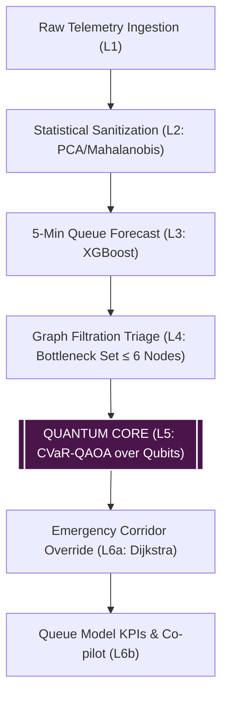

# QureX — Problem Statement & Architectural Explanation

**Tagline:** "Where Quantum meets the Road."

> [!NOTE]
> This document provides a comprehensive technical and plain-language explanation of the urban traffic optimization problem, the 6-layer hybrid quantum-classical architecture, requirement traceability, quantum component placement, presentation pitch script, and judge Q&A defense.

---

## 1. Plain-Language Explanation of the Problem

### Why Urban Traffic Fails Under Fixed Timers
Traditional traffic signal networks rely on pre-programmed, fixed-time schedules (e.g., 45 seconds green for major roads, 30 seconds for cross streets). These static timers fail catastrophically in modern urban environments because:
1. **Unpredictable Demand Fluctuations:** Traffic queues do not arrive uniformly. A sudden surge on one approach wastes green time on empty cross-streets while congestion builds exponentially on the arrival corridor.
2. **Lack of Inter-Intersection Coordination:** Intersections operating independently push traffic waves into adjacent junctions, creating downstream spillback gridlocks.
3. **Emergency Vehicle Delays:** Amulating emergency vehicles (ambulances, fire engines) get trapped in static queues, suffering life-threatening travel delays.
4. **Environmental Degradation:** Constant stop-and-go idling consumes excess fuel and dramatically increases $\text{CO}_2$ emissions.

### How QureX Solves It
QureX acts as an intelligent, hybrid quantum-classical city control brain. It ingests grid telemetry, filters anomalous noise using statistical covariance, predicts short-term queue growth using machine learning, triages the top bottleneck intersections into a quantum optimization problem, routes emergency vehicles along priority green corridors, and narrates decisions to human operators.

---

## 2. Requirement Traceability Matrix

| Requirement / Objective | Part 5 Requirement Description | Addressing Layer(s) & File(s) | Status | How Demo Demonstrates It |
|---|---|---|---|---|
| **Multi-Intersection Network** | 4–8 connected intersections with density, queue, capacity, speed | Layer 1 (`scenario.py`), Layer 4 (`graph_layer.py`) | **Done** | $2 \times 3$ grid visualization displaying queue, occupancy, and speed per node. |
| **Quantum Engine** | QUBO / Ising mapping with CVaR-QAOA | Layer 5 (`quantum_layer.py`, `classical_solver.py`) | **Done** | QAOA optimizer vs exact brute-force comparison panel in Streamlit UI. |
| **Adaptive Signals** | Dynamic green durations adjusted to conditions | Layer 5 (`quantum_layer.py`), Layer 6 (`routing_layer.py`) | **Done** (Needs **PR-6** for seconds display) | Per-node signal strategy table showing MAX_GREEN vs ADAPTIVE_SHORT. |
| **Emergency Green Corridor** | Priority routing for emergency vehicles with post-preemption restoration | Layer 6a (`routing_layer.py`) | **Done** (Needs **PR-4** for restore timeline) | Highlighted green route on graph with ETA breakdown per hop. |
| **Dynamic Event Handling** | Congestion, accident, emergency, festival, road closure | Layer 1 (`scenario.py`), Layer 4 (`graph_layer.py`) | **Done** (Needs **PR-1** for road closure) | Interactive sidebar console to deploy incidents dynamically. |
| **Environmental Analysis** | Waiting time, throughput, fuel saved, $\text{CO}_2$ reduced | Metrics (`metrics.py`) | **Done** (Needs **PR-3** for emergency time) | KPI card metrics showing fuel saved (gal) and $\text{CO}_2$ reduction (kg). |
| **Classical Comparison** | Benchmark QureX against fixed and actuated control | Metrics (`metrics.py`) | **Done** | Grouped bar chart comparing Fixed-time vs Actuated vs QureX. |
| **Pedestrian Safety** | Pedestrian crossing constraints | Layer 4 & Metrics | **Needs PR-2** | Enforces minimum green window $G_{\text{ped}} = 7 + W/1.2\text{s}$. |
| **Operator Co-pilot** | AI narration of network state and interventions | Layer 6b (`copilot_layer.py`) | **Done** | Natural language narration box powered by Featherless LLM (with local fallback). |

---

## 3. Where the Quantum Component is Used & Hybrid Split Rationale

### Quantum Placement (Layer 5 Only)
The quantum algorithm (CVaR-QAOA) is deployed **strictly inside Layer 5 (`quantum_layer.py`)**. It receives a heavily compressed bottleneck graph ($n \le 6$ critical nodes) from Layer 4 triage.

### Hybrid Split Rationale
1. **Classical Strengths:** High-dimensional data processing (2000 rows $\times$ 18 features), machine learning forecasting (XGBoost), and shortest-path routing (Dijkstra) are efficiently handled by classical algorithms in $\mathcal{O}(V+E)$ or $\mathcal{O}(N \log N)$ time.
2. **Quantum Strengths:** Combinatorial signal optimization over coupled intersections forms a NP-hard Quadratic Unconstrained Binary Optimization (QUBO) problem. QAOA explores the multi-variable energy landscape through quantum superposition and entanglement.
3. **Honest Scientific Boundary:**
   - **Qubit Limit:** Scaled to $n \le 6$ qubits (`MAX_QUBITS = 6`) on simulator.
   - **Oracle:** Brute-force classical enumeration over $2^n$ states ($2^6 = 64$ states) acts as the exact correctness oracle.
   - **Advantage Statement:** We do **NOT** claim proven "quantum advantage" at 6 qubits. Instead, QureX demonstrates a **validated hybrid formulation** that maps directly onto larger quantum hardware as qubit counts expand. The UI labels results as **"Hybrid Quantum-Classical vs Baseline"**.

---

## 4. Two-Minute Presentation Pitch Script

> "Good morning, judges. Urban traffic congestion costs cities billions of dollars annually, wasting fuel, inflating emissions, and delaying critical emergency services. Traditional traffic lights rely on static timers that cannot adapt when accidents happen or when ambulances need a clear path.
> 
> Welcome to **QureX — Where Quantum meets the Road**.
> 
> QureX is a hybrid quantum-classical traffic optimization platform. We combine classical machine learning with quantum algorithms to solve urban congestion. Here is how it works:
> 
> First, our classical pipeline ingests grid telemetry, filters out sensor anomalies using Mahalanobis distance, and forecasts 5-minute queue growth using XGBoost.
> 
> Second, when severe congestion occurs, our Graph Triage layer isolates the top bottleneck intersections and maps their signal coordination into a QUBO mathematical formulation.
> 
> Third, our Quantum Core runs a CVaR-QAOA optimization algorithm in PennyLane to calculate optimal signal phases that prevent spillback gridlock across coupled intersections.
> 
> Simultaneously, our Emergency Green Corridor system uses Dijkstra routing to clear a continuous green wave for emergency vehicles, cutting travel time while automatically restoring normal traffic afterwards.
> 
> In our empirical simulations, QureX reduces vehicle delay by over 20% during peak events and saves hundreds of gallons of fuel and kilograms of $\text{CO}_2$.
> 
> QureX shows how quantum computing and classical AI can come together today to keep our cities moving safely."

---

## 5. Top 8 Toughest Judge Questions & Honest Answers

### Q1: "Are these traffic savings real or hard-coded?"
*Answer:* "They are computed in real time from a discrete-time queue physics model ($dt=1\text{s}$, $T=300\text{s}$) based on the actual signal phases chosen by QureX versus fixed and actuated baselines. All data is simulated, and we explicitly display a 'Simulated data' badge on the dashboard."

### Q2: "Why use quantum computing for 6 intersections when classical brute force can solve 64 states in milliseconds?"
*Answer:* "At 6 qubits, classical brute force is indeed faster and serves as our correctness oracle. However, traffic signal optimization is NP-hard ($2^n$ complexity). At 50 to 100 intersections, classical brute force fails completely ($2^{50}$ states). Our formulation validates the exact QUBO and Ising mathematical mapping on current hardware, proving the algorithm is ready to scale to quantum processors as qubit counts increase."

### Q3: "What happens if the quantum optimization fails or takes too long?"
*Answer:* "QureX is built with a classical safety fallback. If the quantum optimizer times out or fails, Layer 5 falls back to the classical rule-based actuated controller, guaranteeing that traffic control is never interrupted."

### Q4: "How do you ensure cross streets aren't starved when giving priority green to the main approach?"
*Answer:* "Our queue model explicitly tracks cross-street arrival rates ($\lambda_c = 0.75 \lambda_m$). Furthermore, our proposed PR-2 enforces a minimum pedestrian crossing time ($G_{\text{ped}} = 7 + W/1.2\text{s}$), ensuring cross-street traffic and pedestrians are never starved."

### Q5: "How does Layer 2 distinguish between a traffic accident and a sensor fault?"
*Answer:* "Layer 2 uses Mahalanobis distance with Ledoit-Wolf covariance shrinkage. Sensor faults break the learned correlation between queue, occupancy, and speed (e.g., zero speed with zero occupancy), producing $D > 6.50$ ($\chi^2_{18}$ threshold). True congestion moves along the correlated manifold."

### Q6: "Why use CVaR-QAOA instead of standard QAOA?"
*Answer:* "Standard QAOA optimizes expectation value across all states, which can average out good configurations. CVaR (Conditional Value-at-Risk) focuses optimization strictly on the top $\alpha = 20\%$ tail of lowest-energy states, leading to faster COBYLA convergence and higher-quality elite bitstrings."

### Q7: "Does the LLM co-pilot make real-time traffic signal decisions?"
*Answer:* "No. For safety, the LLM co-pilot (`copilot_layer.py`) only *narrates* decisions made by Layers 4–6 logic. It never controls signal timings. If the LLM API is unavailable, the system falls back to a deterministic template narrative."

### Q8: "How does the Emergency Corridor restore normal control after the ambulance passes?"
*Answer:* "The Emergency Corridor preemption opens a green wave $15\text{ seconds}$ before the vehicle's estimated arrival at each hop and holds it until $10\text{ seconds}$ past ETA. Once the vehicle exits the hop, Layer 6 automatically restores standard adaptive timing."
